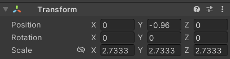

可通过 Unity Asset Store (资源商店) 导入资源或外部文件导入

Unity Package Manager (UPM) 可将各种资源（包括插件、工具和库）直接安装到 Unity 中


## 1. Getting Started

### 1.1 Unity 编辑器窗口


当创建一个新的 Unity Project 会包含以下文件夹：
Temp、Library、Assets （存储资源文件）、PrjectSettings、Logs、Packages


- Project 窗口：列出项目中包含的文件和目录（项目中的图像、声音、3D模型等都统称为 资源）

- Console 窗口：显示游戏产生的警告、错误等相关信息

- Hierarchy 窗口：显示场景中的所有 游戏对象（每个场景中的对象列表）以及父子关系

- Scene 视图：实时预览当前场景及其所有游戏对象

- Game 视图：测试游戏时的显示视图

- Inspector 窗口：在 Hierarchy 或 Project 视图中选择某个项时，Inspector 将显示与这个项相关的所有数据


### 1.2 工具栏与视图操作


播放（Play）：用于当前视图场景

暂停（Pause）：暂停Game视图运行的游戏

单步执行（Step）：逐帧调试

F - 聚焦选择的对象。如果忘记了游戏对象在场景中的位置，只需在 Hierarchy 中选择该游戏对象，然后按 F 键使该游戏对象在 Scene 视图中居中。


在 Scene 视图中时，你可以：
单击鼠标左键以在场景中选择你的游戏对象。
单击鼠标中键并拖动以使用手形工具移动 Scene 视图的摄像机。
单击鼠标右键并拖动以使用飞越模式（手形工具的一种变体）旋转 Scene 视图的摄像机。


在 3D 项目中，还可以单击鼠标右键并使用相应按键来旋转视图，从而移动摄像机：
向左和向右：使用 A 和 D
向前和向后：使用 W 和 S
向下和向上：使用 Q 和 E


（update）


## 2.Player Control

### 2.1 角色控制器

输入设置： Edit > Project Settings > Input


Input 页面中列出玩家的输入控件的 Axes 值（比如 Horizontal，Vertical），值的范围 [-1, 1] (具体值取决于玩家的操控)，通过编写继承于 `MonoBehavior` 类的子类实现角色控制



（创建 Scripts 文件夹，创建 C# 脚本文件）

- 通过 `Input.GetAxis("XXX")` 获取指定的输入的属性值

- `transform` 类对象包含游戏对象的位置、角度、尺寸等属性，通过 `transform.XXX` 获取对应属性

- `Debug.Log(XXX)` Unity输出控制台，在 Unity 的 Console 开启 Collapse 可以折叠连续重复输出的内容


- 因为 `Update()` 函数是每帧调用一次，为了控制角色移动以 单位/秒 速度移动，而不是 单位/帧 速度移动，因此将移动速度乘以每帧的时间值 `Time.deltaTime`，从而转换为秒为单位（每秒移动单位为其系数，E.g 3.0f）

- 在 Unity 界面


```c#
using System.Collections;
using System.Collections.Generic;
using UnityEngine;

public class RubyController : MonoBehaviour
{
   // 在第一次帧更新之前调用 Start
   void Start()
   { 
       //QualitySettings.vSyncCount = 0;
       //Application.targetFrameRate = 10;   将帧率调整为 每秒10帧（默认60帧每秒）
   }
   // 每帧调用一次 Update
   void Update()
   {
       float horizontal = Input.GetAxis("Horizontal");
       float vertical = Input.GetAxis("Vertical");
       Vector2 position = transform.position;
       position.x = position.x + 3.0f * horizontal * Time.deltaTime;
       position.y = position.y + 3.0f * vertical * Time.deltaTime;
       transform.position = position;
   }
}

```


