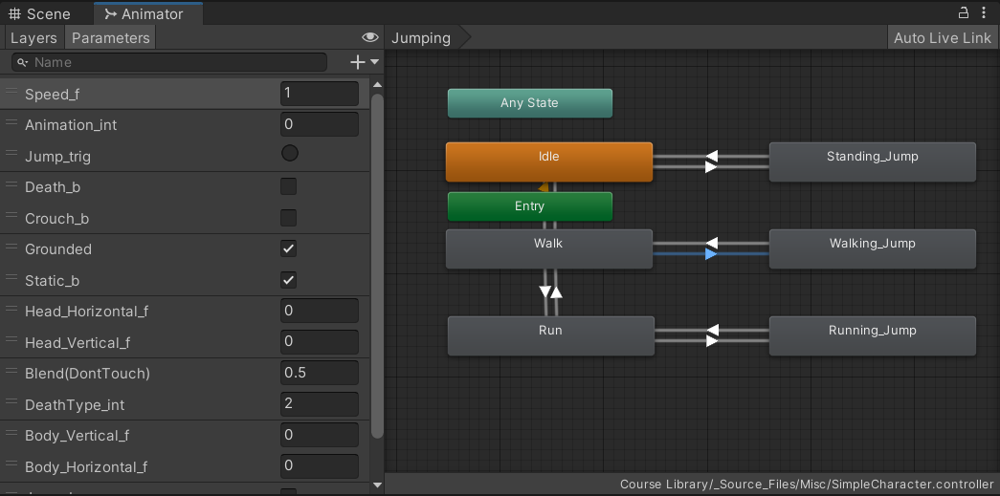

## 1. Getting Started

### 1.1 Unity 编辑器简介


当创建一个新的 Unity Project 会包含以下文件夹：
Temp、Library、Assets （存储资源文件）、PrjectSettings、Logs、Packages


- Project 窗口：列出项目中包含的文件和目录（项目中的图像、声音、3D模型等都统称为 资源）

- Console 窗口：显示游戏产生的警告、错误等相关信息

- Hierarchy 窗口：显示场景中的所有 游戏对象（每个场景中的对象列表）以及父子关系

- Scene 视图：实时预览当前场景及其所有游戏对象

- Game 视图：测试游戏时的显示视图

- Inspector 窗口：在 Hierarchy 或 Project 视图中选择某个项时，Inspector 将显示与这个项相关的所有数据

（Unity 可以自定义编辑器 Layout，并保存自定义）


### 1.2 工具栏与视图操作


播放（Play）：用于当前视图场景

暂停（Pause）：暂停Game视图运行的游戏

单步执行（Step）：逐帧调试


在 Scene 视图中：

鼠标左键：在场景中选择你的游戏对象。

鼠标中键并拖动：使用手形工具平移 Scene 视图。

鼠标右键并拖动（alt + 左键）：使用飞越模式（手形工具的一种变体）旋转 Scene 视图。

鼠标中键滚动（alt + 右键）：拉远拉近 Scene 视图

F - 聚焦选择的对象。如果忘记了游戏对象在场景中的位置，只需在 Hierarchy 中选择该游戏对象，然后按 F 键使该游戏对象在 Scene 视图中居中。

Scene 右上角，点击指定轴方向，实现从指定方向观察（在调整游戏对象角度是可以使用）


### 1.3 资源导入

可通过 Unity Asset Store (资源商店) 导入资源 或 外部文件导入

( Assets > Import XXX )

Unity Package Manager (UPM) 可将各种资源（包括插件、工具和库）直接安装到 Unity 中 

(Window > Package Manager)


### 1.4 输入

玩家可通过手柄、VR设备、键盘、鼠标等方式进行输入

通过 Edit > Project Setting > Input Manager，可以观察和设置输入


Input 页面中列出玩家的输入控件的 Axes 值（比如 Horizontal，Vertical），值的范围 [-1, 1] (具体值取决于玩家的操控)，通过编写继承于 `MonoBehavior` 类的子类实现角色控制，代码中获取对应输入内容：

```C#
horizontalInput = Input.GetAxis("Horizontal");
```


## 2. 游戏对象

在 Unity 中有游戏中的每个物体都是 **游戏对象（GameObject）**，比如人物、道具、灯光、特效、光源、摄像机等，通过设置相关的 **组件 （Component）** 来调整游戏对象的属性。

在脚本代码中：

`GameObject a = GameObject.Find("GameObjName")` ：取指定名称的游戏对象，甚至可以获取到游戏对象的脚本组件的内容；

 `XXX a = GetComponent<XXX>()`：获取游戏对象中的组件

```C#
private PlayerController playerControllerScript;
void Start()
{
    playerControllerScript = GameObject.Find("Player").GetComponent<PlayerController>();
}
////////////////////////////////////////////////////////
private Rigidbody playerRb;
void Start()
{
    playerRb = GetComponent<Rigidbody>();
    Physics.gravity *= gravityModifier;
}
```


### 2.1 游戏对象标签

游戏对象可以添加、设置类别标签 Tag：


在脚本代码中：

`gameObject.CompareTag("TagName")`：判断当前游戏对象的标签类型
```C#
private void OnCollisionEnter(Collision other) {
    if (other.gameObject.CompareTag("Ground")){
        isOnGround = true;
    } else if (other.gameObject.CompareTag("Obstacle")){
        gameOver = true;
        Debug.Log("Game Over!");
    }
}
```


## 3. 组件 Component

游戏对象包含了多项 `Component` （Transform、Mesh Renderer 等），在 `Inspector` 窗口 使用 `Add Component` 可为游戏对象添加不同功能的 `Component`


### 3.1 角色控制器

通过 C# 脚本控制游戏对象的行为 （继承于 `MonoBehaviour` 类），脚本作为 Component 添加给对应的游戏对象，一个脚本可以用到多个游戏对象（类内部包含一个 `gameObject` 对象表示对应的游戏对象），一个游戏对象可以使用多个脚本，


（创建 Scripts 文件夹，创建 C# 脚本文件）

- 通过 `Input.GetAxis("XXX")` 获取指定的输入的属性值

- `transform` 类对象包含游戏对象的位置、角度、尺寸等属性，通过 `transform.XXX` 获取对应属性，并操控游戏对象移动，比如：

```C#
transform.Translate(Vector3.forward * Time.deltaTime * speed)
// Vector3.up / right / left ...
```

- `Debug.Log(XXX)` Unity 输出控制台，在 Unity 的 Console 开启 `Collapse` 可以折叠连续重复输出的内容


-  `Update()` 函数是每帧调用一次;

   `LateUpdate()` 函数在所有 `Update` 执行完后在执行，（相机跟随可以使用`LateUpdate`，若相机跟随使用 `Update`，会导致游戏视图抖动现象，因为游戏对象和相机调用 `Update` 的次序不固定） 

- 为了控制角色移动以 单位/秒 速度移动，而不是 单位/帧 速度移动，因此将移动速度乘以每帧的时间值 `Time.deltaTime`，从而转换为秒为单位（每秒移动单位为其系数，E.g 3.0f）

- 声明为 `public` 变量，可在 Unity 的对应 游戏对象中的 `Inspector` 中观察并调整变量的值，比如相机的 `public GameObject player` 可在 `Inspector` 中通过拖拽指定游戏对象方式赋值

```c#
using System.Collections;
using System.Collections.Generic;
using UnityEngine;

public class PlayerControllor : MonoBehaviour
{
    private float speed = 10.0f;
    private float turnSpeed = 25.0f;
    private float horizontialInput;
    private float verticalInput;
    // Start is called before the first frame update
    void Start()
    {  }

    // Update is called once per frame
    void Update()
    {   // get player input
        verticalInput = Input.GetAxis("Vertical");
        horizontialInput = Input.GetAxis("Horizontal");
        // move the car forward base on  vertical input
        transform.Translate(Vector3.forward * Time.deltaTime * speed * verticalInput);
        // rotate the car base on horizontal input
        transform.Rotate(Vector3.up, Time.deltaTime * turnSpeed * horizontialInput);
    }
}

// Camera
public class FollowPlayer : MonoBehaviour
{
    public GameObject player;
    private Vector3 offset = new Vector3(0, 8, -7);
    // Start is called before the first frame update
    void Start(){}

    // Update is called once per frame
    void LateUpdate()
    {
        transform.position = player.transform.position + offset;
    }
}

/*
Vector3.MoveTowards(transform.position, playerRunPos, 3.0f * Time.deltaTime);
*/
```

### 3.2 RigidBody & Collider

刚体与碰撞体常用于子弹碰撞、物体碰撞、物体下落等场景

- 刚体 （Rigidbody）

    `RigidBody` 刚体组件使得游戏对象具有物理属性，`Mass` 为质量，`Use Gravity` 表示是否使用重力

    

- 碰撞体

    碰撞体要与刚体一起添加到游戏对象上才能触发碰撞（没有碰撞体的刚体会彼此相互穿过），可以触发对撞事件（勾选 `Is Trigger`），可用于子弹攻击碰撞、攻击毁坏物体等碰撞场景

    `Mesh Collider` 网格对撞机

    

    `Box Collider` 箱型对撞机

    

    （`Box Collider` 可以通过 `Edit Collider` 的图标在 Scene 窗口中编辑碰撞箱型尺寸）


    碰撞体的触发事件：重写 `OnTriggerEnter()` 函数，并且将脚本添加到碰撞对象上（比如子弹）

    ```C#
    private void OnTriggerEnter(Collider other) {
            Destroy(gameObject);        // 销毁当前游戏对象
            Destroy(other.gameObject);  // 销毁另一个碰撞对象
    }
    ```

碰撞事件监测方法：

`OnCollisionEnter(Collision)`： 当碰撞开始时调用，只会调用该方法一次
`OnCollisionExit(Collision)`：当碰撞结束时调用，只会调用该方法一次
`OnCollisionStay(Collision)`：当碰撞进行中时，会持续调用该方法

（`Collision coll` 参数：用于传递碰撞信息对象，通过 `coll.gameObject` 可以获取被碰撞的对象，比如脚本绑定到子弹上，那么子弹打箱子，就会得到引用箱子的信息）

通过刚体和碰撞检测，为人物实现简单的跳跃：
1. 获取游戏人物的 `Rigidbody` 组件，通过 `Physics.gravity` 可以设置重力系数
2. 通过对 `Rigidbody` 组件调用 `AddForce(Vector3, ForceMode)` 函数为游戏人物添加一个力实现跳跃（设置力的方向，发力模式）

```C#
private Rigidbody playerRb;
public float jumpForce;
public float gravityModifier;
public bool isOnGround = true;
public bool gameOver = false;
void Start(){
    playerRb = GetComponent<Rigidbody>();
    Physics.gravity *= gravityModifier;
}
void Update(){
    if (Input.GetKeyDown(KeyCode.Space) && isOnGround){
        playerRb.AddForce(Vector3.up * jumpForce, ForceMode.Impulse);
        isOnGround = false;
    }
}
private void OnCollisionEnter(Collision other) {
    if (other.gameObject.CompareTag("Ground")){
        isOnGround = true;
    } else if (other.gameObject.CompareTag("Obstacle")){
        gameOver = true;
        Debug.Log("Game Over!");
    }
}
```


## 4. 瓦片地图 Tilemap


瓦片地图不会直接使用精灵，通过在Hierarchy 窗口右击 > 2D Object > Tilemap 创建瓦片地图 （包含Rectangle、Hexagonal等多种瓦片类型）

对于一张包含多种素材的素材图，需要切割将素材图分割成多分形成多个精灵

创建 Tile Palette，将素材图拖拽到其中，通过Tile Palette 相关地图绘制工具进行 Tilemap 的绘制

（update...）

## 5. 预制件 Prefab

如果要在场景中的多个位置或项目中的多个场景之间重用以特定方式配置的游戏对象，比如非玩家角色 (NPC)、道具或景物，则应将此游戏对象转换为预制件。这种方式比简单复制和粘贴游戏对象更好，因为预制件系统可以自动保持所有副本同步

如果游戏对象在一开始不存在于场景中，而希望在运行时实例化游戏对象（例如，使能量块、特效、飞弹或 NPC 在游戏过程中的正确时间点出现），那么也应该使用预制件。

通过对游戏对象进行相关的设置（组件、控制脚本等），然后在文件目录中创建 Prefabs 目录，将游戏对象从 Hierarchy 中拖拽到目录文件夹中以创建游戏对象的预制件

（如果对 Hieratchy 中的预制件进行了修改，可以通过 Inspector 中 Override 通修改同步到预制件中）


在运行过程中通过 Instantiate() 函数创建预制件游戏对象，该函数有多种重载版本：

```C#
if (Input.GetKeyDown(KeyCode.Space)){
    // 参数1：GameObject  参数2：创建位置  参数3：游戏对象的角度
    // projectile为成员变量，在Unity界面将对应的预制件拖拽进行赋值
    Instantiate(projectile, transform.position, projectile.transform.rotation);
}
```

## 6. 动画、粒子效果与音频

### 6.1 动画

（update）

在游戏对象中添加 Animator 组件，设置动画内容


动画的条件参数：




```C#
private Animator playerAnim;
void Start(){
    playerAnim = GetComponent<Animator>();
}

// 通过设置状态条件触发指定动画
playerAnim.SetTrigger("Jump_trig");
playerAnim.SetBool("Death_b", true);
playerAnim.SetInteger("DeathType_int", 1);

```


### 6.2 粒子效果 Particle

（update）

将预制件的粒子效果拖拽到场景，代码中声明粒子类型对象 `ParticleSystem` ，Unity 中拖拽粒子特效对象进行赋值，代码调用函数控制粒子效果播放


```C#
public ParticleSystem explosionParticle;
public ParticleSystem dirtParticle;

dirtParticle.Play();
dirtParticle.Stop();
// ...
```

### 6.3 音频

游戏对象中添加 `Audio Source` 组件来播放声音，例如在 `Main Camera` 中添加 `Audio Listener` 来听取声音，通过 `Audio Source` 播放背景音乐（为其赋值音频对象，loop 设置为 true 以循环播放）；

在代码中，声明 `AudioClip` 对象，Unity 中拖拽声音特效进行赋值；代码中 `GetComponent<AudioSource>()` 获取音频源组件对象，通过该对象调用相关函数播放声音特效


```C#
public AudioClip crushSound;
public AudioClip jumpSound;

void Start(){
    playerAudio = GetComponent<AudioSource>();
    //...
}

playerAudio.PlayOneShot(jumpSound, 1.0f);
playerAudio.PlayOneShot(crushSound, 1.0f);

```


## Unity 开发技巧

### 1. 游戏视角

#### 1. 第一人称视角与第三人称视角的切换

创建两个相机（P1，P3）对应第一人称视角与第三人称视角，将相机分别移动到对应视角的位置（其中第一人称视角需要在人物角色层级之中，并且角色添加 `RigidBody` 组件）
，通过 `GameObject.SetActive()` 实现相机的切换控制

- 第三视角，编写相机跟随脚本并添加脚本到 P3 中

    ```C#
    public class FollowPlayer : MonoBehaviour
    {
        public GameObject player;
        private Vector3 offset = new Vector3(0, 8, -7);
        // Start is called before the first frame update
        void Start()
        {}
        // Update is called once per frame
        void LateUpdate()
        {
            transform.position = player.transform.position + offset;
        }
    }
    ```

- 第一人称视角，编写相机切换脚本并添加脚本到游戏角色中

    ```C#
    public class PlayerControllor : MonoBehaviour
    {
        public GameObject thirdCamera;
        public GameObject firstCamera;
        private bool cameraStatus = true;
        // ...
        // Start is called before the first frame update
        void Start()
        {        
            firstCamera.SetActive(cameraStatus);
            thirdCamera.SetActive(!cameraStatus);
            // ...
        }
        // Update is called once per frame
        void Update()
        {
            // ...
            // get player input switch camera if F down
            if(Input.GetKeyDown(KeyCode.F)){
                if(cameraStatus == true){
                    firstCamera.SetActive(false);
                    thirdCamera.SetActive(true);
                    cameraStatus = false;
                }else{
                    firstCamera.SetActive(true);
                    thirdCamera.SetActive(false);
                    cameraStatus = true;
                }
            }
            // ...
        }
    }
    ```


### 2. 射击游戏

#### 1. 子弹射击

为子弹添加相关的控制脚本（移动、界外销毁、碰撞销毁等），为子弹添加 `RigidBody` 与 `Collider` 组件， 在被攻击对象也添加 `Collider` 组件，创建子弹预制体；

在游戏角色的控制脚本中，添加对应的按键响应逻辑，生成子弹预制体实现射击（注意生成时的角度、位置）


```C#
// Destroy out of bounds
public float topBound = 50.0f;
public float downBound = -20.0f;
void Update()
{
    if (transform.position.z >= topBound){
        Destroy(gameObject);
    } else if (transform.position.z <= downBound){
        Destroy(gameObject);
    }
}

// Move forward
public float MoveSpeed = 40.0f;
void Update()
{
    transform.Translate(transform.forward * MoveSpeed * Time.deltaTime);
}

// Detect collisions
private void OnTriggerEnter(Collider other) {
    Destroy(gameObject);
    Destroy(other.gameObject);
}
```


### 3. 多人游戏

#### 1. 双人分屏

创建两个摄像机调整至合适角度，设置两个相机的相关视口参数 （X 为内容显示起始横坐标， W 为相机拍摄的宽度）


### 4. 通用技巧

#### 1. 间隔时间随机位置生成随机敌人

Unity 中使用 Random.Range(a, b) 可以生成整数，范围： [a, b)

在 `Hierarchy` 创建一个空的游戏对象（右键 > Create Empty），并且为该游戏对象创建一个 SpawnManager 脚本，用于管理游戏对象的生成：

1. 创建游戏对象数组作为成员变量，内部包含各种待生成的游戏对象（通过 Unity 界面拖拽对应的预制件进行数组的赋值）

2. 创建用于生成游戏对象的函数，函数通过生成随机数，在随机位置生成随机游戏对象

3. 在 Start() 函数中使用 `InvokRepeating()` 注册重复执行间隔时间调用函数

```C#
public class SpawnManager : MonoBehaviour
{
    public GameObject[] animalPrefabs;

    private float spawnXRange = 20.0f;
    private float spawnPosZ = 20.0f;
    private float startDelay = 2.0f;
    private float interval = 1.5f;
    // Start is called before the first frame update
    void Start()
    {   // 参数1：调用的函数名  参数2：第一次调用的延迟时间  参数3：调用函数的时间间隔
        InvokeRepeating("SpawnRandomAnimal", startDelay, interval);
    }

    // Update is called once per frame
    void Update()
    {
    }

    void SpawnRandomAnimal(){
        int animalIndex = Random.Range(0, animalPrefabs.Length);
        Vector3 spawnPos = new Vector3(Random.Range(-spawnXRange, spawnXRange), 0,  spawnPosZ);
        Instantiate(animalPrefabs[animalIndex], spawnPos, animalPrefabs[animalIndex].transform.rotation);
    }
}
```