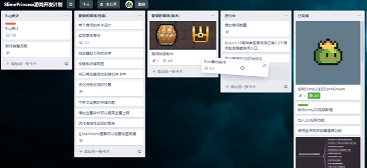

### 开发引擎
Unity (c#)

Godot（GDScrip）

### Git
源代码管理

### Trello
项目管理，工作进程管理

### Aseprite
像素动画制作

### Pinterest
游戏素材参考

### Todoist
代办事项管理

### 游戏开发社交
Twitter、Discord

unity中文文档：https://docs.unity.cn/cn/current/Manual/index.html

unityLearn：https://learn.unity.com/projects

动作资源：https://www.wemakethegame.com/

角色资源：https://assetstore.unity.com/publishers/10786

大佬整理：https://www.zhihu.com/people/ud-27-49/posts

C#

《C#本质论》

unity

《Unity 5.x 从入门到精通》

《Unity 2D 游戏开发教程》