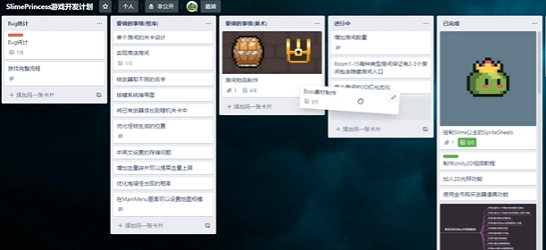
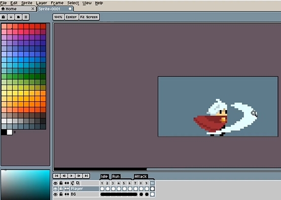
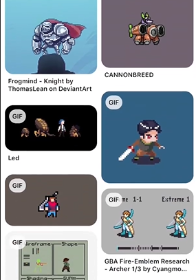
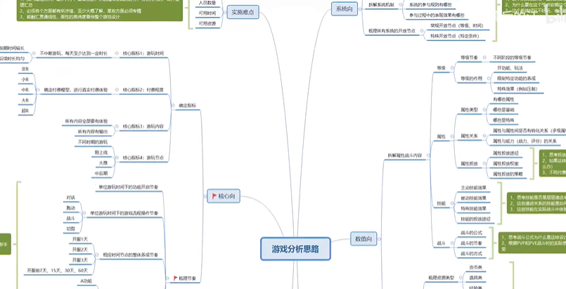
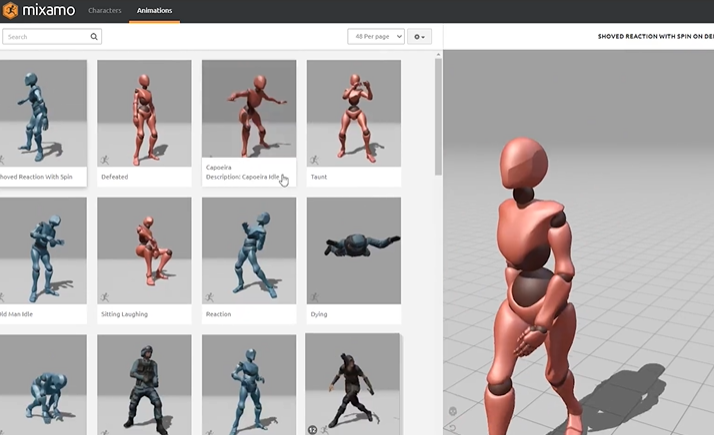

### 1. 开发工具

1. 开发引擎：Unity (c#)、Godot（GDScrip）

2. Git：源代码管理

3. Trello：项目管理，工作进程管理

    

4. Aseprite：像素动画制作

    

5.  Pinterest：游戏素材参考

    

6. XMind：思维导图做策划

7. Todoist：代办事项管理

8. 游戏开发社交：Twitter、Discord

### 2. 相关学习资源

C#：《C#本质论》、菜鸟教程

Unity：《Unity 5.x 从入门到精通》、《Unity 2D 游戏开发教程》

unity中文文档：https://docs.unity.cn/cn/current/Manual/index.html

unityLearn：https://learn.unity.com/projects （包含入门、中高级知识）

动作资源：https://www.wemakethegame.com/

角色资源：https://assetstore.unity.com/publishers/10786

大佬整理：https://www.zhihu.com/people/ud-27-49/posts

### 3. 游戏设计步骤

1. 游戏策划：确定游戏类型，比如2D的 平台跳跃、横版射击等，3D的RPG、解密等，设计核心玩法，实现Demo，不断扩展外围功能

    

2. 获取游戏资源素材：场景资源、角色资源、音频等

    - 官方资源 Unity Learn ：SURIYUN、WeMakeTheGame、2D Game Kit,3D Game Kit (Lite) 、FPS MicroGame （第一人称射击类游戏包） 和 Karting MicroGame （第三人称驾驶类游戏包）

    - MIXAMO

        